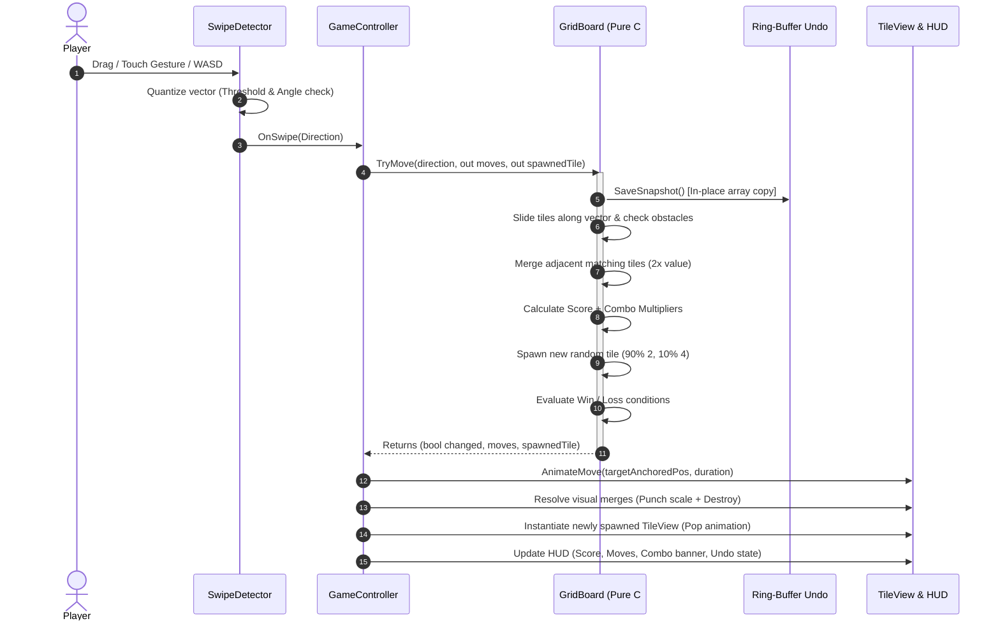

# Grid Puzzle Challenge - Architecture & Engineering Documentation

A high-performance, polished, mobile grid puzzle game developed in Unity 6, built strictly according to decoupled software architecture and clean code engineering principles.

---

## 1. System Architecture Map

The project implements a decoupled **Model-View-Presenter (MVP)** architecture. The core simulation model contains **zero** `UnityEngine` dependencies and operates completely independently of the visual rendering pipeline.

```mermaid
classDiagram
    direction TB

    package "Input Pipeline" {
        class SwipeDetector {
            +event Action~Direction~ OnSwipe
            +OnPointerDown(PointerEventData)
            +OnDrag(PointerEventData)
            +OnPointerUp(PointerEventData)
        }
    }

    package "Presentation & View Layer" {
        class GameController {
            -GridBoard _board
            -Dictionary~int, TileView~ _activeTiles
            +StartNewGame()
            +OnUndoClicked()
            +OnToggleHammerPowerUp()
            +OnTileClicked(TileView)
        }

        class TileView {
            +int TileId
            +int Value
            +bool IsObstacle
            +Vector2Int GridPosition
            +Setup(TileData, Vector2Int, Vector2, Vector2)
            +MoveTo(Vector2, Vector2Int, float, Action)
            +UpdateValue(int)
        }
    }

    package "Core Domain Simulation (Pure C#)" {
        class GridBoard {
            +int Width
            +int Height
            +TileData[,] Grid
            +int Score
            +int MovesRemaining
            +int ComboCount
            +bool CanUndo
            +Initialize(int, int)
            +TryMove(Direction, out List~TileMove~, out TileData?) bool
            +Undo() bool
            +BreakTile(int, int, out int) bool
        }

        class TileData {
            +int Id
            +int Value
            +TileType Type
            +bool IsEmpty
            +bool IsObstacle
        }

        class BoardSnapshot {
            +TileData[] Tiles
            +int Score
            +int MovesRemaining
            +int NextTileId
        }
    }

    SwipeDetector --> GameController : OnSwipe(Direction)
    GameController --> GridBoard : TryMove / Undo / BreakTile
    GameController --> TileView : Controls Animations & Spawns
    GridBoard *-- TileData : 2D Matrix [N, M]
    GridBoard *-- BoardSnapshot : Circular Ring Buffer (Capacity 32)
```

---

## 2. Functional Code Flow Lifecycle

Lifecycle data pipeline from initial user input through logical update to UI rendering:



---

## 3. Engineering & Algorithmic Highlights

### 3.1. $N \times M$ Logical Grid Simulation
- Pure C# domain model (`GridBoard.cs`), testable in standard .NET runtimes without Unity scene dependencies.
- Directional sliding runs in $O(N \times M)$ single-pass time complexity per swipe.
- Strict boundary validation and obstacle collision checks.

### 3.2. Deterministic State History (Undo) & Memory Safety
- Implements a pre-allocated **Circular Ring Buffer** (`BoardSnapshot[32]`) holding value-type state snapshots.
- **Zero GC Allocations**: Tile arrays within snapshot slots are pre-allocated during initialization. State capturing is an in-place `Array.Copy` memory transfer.
- Eliminates deep-copy overhead and prevents state-tracking memory leaks.

### 3.3. Gesture & Pointer Vector Tracking Pipeline
- Supports Mobile Touch, Mouse/Pen drag, and Desktop keyboard inputs (WASD / Arrow keys).
- Employs minimum swipe distance threshold ($40\text{px}$) and deadzone filtering to avoid erroneous triggers.
- Quantizes swipe vectors into discrete 4-way commands (`Up`, `Down`, `Left`, `Right`).

### 3.4. Candidate Initiative Gameplay Hooks
1. **Synergistic Combos**: Multiple tile merges within a single swipe trigger a combo multiplier (e.g. double merge awards $2\times$ score bonus) displayed with animated visual feedback.
2. **Obstacle Tiles (`BLOCK`)**: Unmovable stone/ice blockers placed on the grid that prevent sliding and merging through their coordinate, adding spatial puzzle depth.
3. **Interactive Hammer Power-Up**: Players can toggle the Hammer tool to destroy any blocker or unwanted tile on the board, opening up strategic pathways. Every power-up action is fully tracked by the deterministic undo system.

---

## 4. Getting Started & Controls

1. Open the project in **Unity 6 (6000.5.1f1)**.
2. Open `Assets/Scenes/SampleScene.unity`.
3. Press **Play**:
   - **Swipe / Drag**: Left-click and drag (or touch and drag) in any of the 4 cardinal directions.
   - **Keyboard**: `W`, `A`, `S`, `D` or `Arrow Keys`.
   - **Undo**: Click `Undo` to step back.
   - **Hammer**: Click `Hammer`, then click any tile or obstacle to smash it.
   - **New Game**: Click `New Game` to restart.

